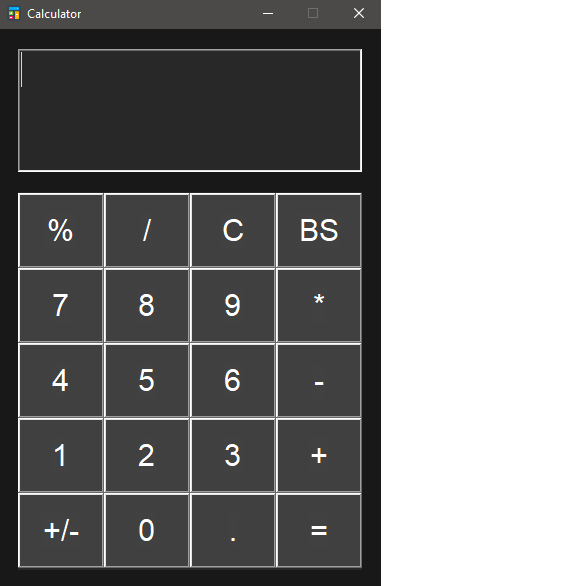

# Calculator_GUI 

<br>
<div align="center">

[](https://github.com/iamwatchdogs?tab=repositories&q=&type=public&language=java&sort=)


<br>

[](https://github.com/iamwatchdogs?tab=repositories&q=&type=public&language=&sort=)
[](https://github.com/iamwatchdogs/Calculator_GUI/pulls)
[](https://github.com/iamwatchdogs/Calculator_GUI/issues)
[](https://github.com/iamwatchdogs/Calculator_GUI.js/pulls?q=is%3Amerged)
[](https://GitHub.com/iamwatchdogs/Calculator_GUI/releases/)
[](https://opensource.org/licenses/Apache-2.0)

</div>
<br>

This a dark-mode GUI-based simple calculator that does all basic arithmetic operations like Add, subtract, multiplication, division and modular division supporting decimal values rounded to a 2-floating point precision. Including that, it does other basic required operations like Backspace, Clear and negate value. I have decided to build this small application based on the concept of MVC Architecture.

- [**CalculatorModel**](./src/calculator/CalculatorModel.java "Goto CalculatorModel.java"): This class does the job of **Model** in MVC Architecture i.e., handles all the calculations and operations required for this Calculator application.
- [**CalculatorView**](./src/calculator/CalculatorView.java "Goto CalculatorView.java"): This class acts as the **View** in MVC Architecture, which means that this class is responsible for handling all the GUI-related for this application.
- [**CalculatorController**](./src/calculator/CalculatorController.java "Goto CalculatorController.java"): This class is the controller, according to MVC Architecture, takes care of all the event handling without interfering with the GUI element directly. This class will execute all the calculations and operations with the help of [CalculatorModel](./src/calculator/CalculatorModel.java "Goto CalculatorModel.java") class and also handles the exceptions that might occur while performing calculations and operations.

I have spent quite a while on this small project trying to learn, understand and implement the concepts of the core Java while trying to implement the industrial standards _(Trying my best to be close to perfect)_. This project helped me get a good understanding of various concepts like MVC Architecture, OOPS, Java AWT, Regular expression, Lambda functions, a bit of generic & collection framework, Event Handling, Exception Handling, annotations, Java Docs, Debugging, PMD, etc. And I'm looking forward to using this small experience to build greater stuff.

> **Note** :
>
> - This project was built using **Eclipse IDE and OpenJDK Temurin-17.0.7+7**.
> - The Java Doc for this project is hosted through GitHub pages, So you can visit the pages to get an overview of the project files.
> - I have decided to build this whole project based only on Java AWT instead of Swing or other libraries, just to make my fundamentals strong.
> - This project is **allowed for personal use, learning and contribution**.
> - Reuploading this project as your own or using it as your project for any kind of submission is **strictly forbidden**.

## Contribution:

Hi, there fellow developer !!!... I'm happy to see you eager to contribute to this repo/project in any way possible. Before you proceed with any kind of contribution, please set up your project within your local system and it is suggested to use **Eclipse IDE** as this project was developed using the very same IDE. After setting it up within your system, go on and try out stuff...

> **Found a bug ???...** Report it by creating an issue right in the issue section.

> **Got an idea to improve ???...** Create an issue suggesting your idea.

> **Want to work on any of the issues you have created or found in the issue section ???...**
>
> > Ping me within the same chat that you want to work on, and I'll assign you the issue so that others might know that you're working on the issue.
> > When you are done create a Pull Request, so that I can review & merge it and also close the issue.

### Prerequisites

Just make sure you're comfortable with the following concepts before you start code-wise contribution:

- **\*Git & GitHub**: At least know how to view issues and make pull requests.
- **\*Core Java**:
  - **Object-oriented Programming** _(Including Abstract Classes, Interfaces)_
  - **Java AWT**
  - Event Handling
  - Exception Handling
  - **Java Docs**
  - **Documenting your code**
- Any other Concept that you want to integrate with the project.

If you're a beginner or don't want to contribute code-wise, then you can help me in other ways mentioned above.

### Basic steps

Let's get started with the very hands-on fundamentals for code-wise contribution...

You can get started by forking this repo and cloning it into your system. Here are some of the git commands you'll be using,

```bash
# Clone your forked repo into your local system
git clone https://github.com/<Your-GitHub-Name>/Calculator_GUI.git

# Creating a new branch
git checkout -b <branch-name>

# Adding all the elements/changes into tracked/staged state
git add .

# Committing your every change
git commit -m "<message>"

# Updating your remote repo (or) pushing your commits to your forked repo
git push origin <branch-name>
```

After you're done with your changes, you can push them back to your remote repository. So that you can send me a pull request to merge the changes into the original Repository.
And I highly suggest every contributor check out the [Important-Rules](CONTRIBUTING.md#important-rules "Goto Important Rules in CONTRIBUTING.md") mentioned in [CONTRIBUTING.md](CONTRIBUTING.md "Goto CONTRIBUTING.md").

> Don't know where to start ???... (or) Sounds too Complicated ???... Check out [CONTRIBUTING.md](CONTRIBUTING.md "Let's go to CONTRIBUTING.md").

## Final Output:

<div align="center">



</div>
